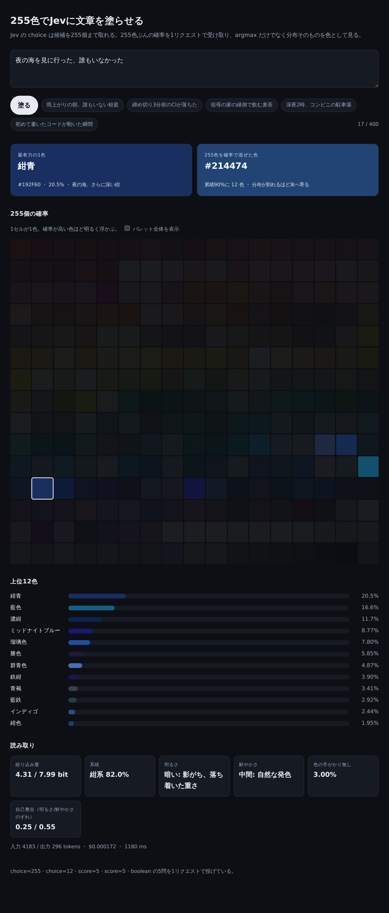
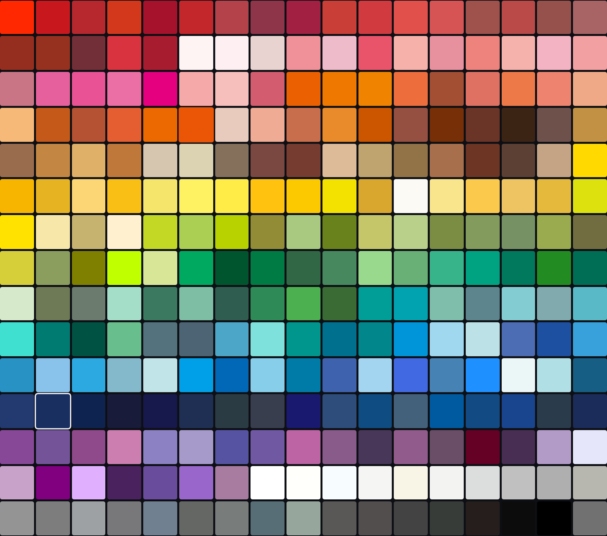

# Jevのchoiceは255個まで取れる。上限まで使って文章を色に塗らせた

[前回は47都道府県あてフォーム](../../jev-form/blog/guessing-prefectures-with-jev.md)を書いて、Jevの確率分布をそのまま画面に出した。あれは分布の読み方の入門としては良かったが、候補の数はこちらが決めたものではない。都道府県は47個しかないので、47択になっただけだ。

Jevの `choice` は候補を255個まで取れる。1バイトで数えられる上限で、47はその2割にも満たない。上限まで使ったとき、分布はどう振る舞うのか。そこを見たくて `jev-color/` を書いた。今度はTypeScript（Bun + AI SDK）で、Pythonから移植する必要がない。

題材は色にした。255個の確率を、そのまま255個の色として画面に敷けるからだ。正解表は持たない。

実装は `jev-color/` にある。2026年9月18日時点で、オフラインのテスト33件と、スタブを通した画面の描画までは確認済み。実Gatewayへの接続は、この記事では未実施です。以下のキャプチャも、固定の分布を返すスタブで描画したもので、Jevの実出力ではありません。

## 画面



文章を1つ入れると、255色ぶんの確率が1リクエストで返る。画面に出しているのは、最有力の1色、255色を確率で混ぜた色、255個の確率の格子、上位12色、そして系統・明るさ・鮮やかさ・絞り込み量といった読み取りだ。

## argmaxだけなら255択にする意味がない

先に困りごとを書いておく。47都道府県のときもそうだったが、choiceの返り値で真っ先に見たくなるのは `choice`、つまり最大確率の候補である。だが最有力の1色だけを見るなら、候補は10個でも足りる。255個の `criteria` を書いて入力トークンを積む理由がない。

255択に意味を持たせるには、残りの254個の確率を使う操作が要る。3つ用意した。

### 確率で混ぜた1色

255色を確率で加重混合する。確信しているときは最有力色とほぼ一致し、分布が割れるほど中間色へ寄っていく。「迷い」が色として出るのが面白いところだ。

混色はsRGBのガンマを外してから行う。

```ts
function toLinear(v: number): number {
  const c = v / 255;
  return c <= 0.04045 ? c / 12.92 : ((c + 0.055) / 1.055) ** 2.4;
}
```

ここを省いて0〜255の値をそのまま平均すると、明るい色が不当に沈む。黒と白を半々で混ぜると素朴な平均は `#808080` になるが、
光として混ぜれば `#BCBCBC` まで明るくなる。確率で色を混ぜる以上、ここは光の側に合わせたい。テストでは「線形空間で混ぜていること」を、単純平均より明るくなるという形で固定した。

```ts
test('混色は線形空間で行う（単純平均より暗くならない）', () => {
  const mixed = mix([{ hex: '#000000', weight: 0.5 }, { hex: '#FFFFFF', weight: 0.5 }]);
  expect(parseHex(mixed).r).toBeGreaterThan(128);
});
```

キャプチャの例では、最有力が紺青（`#192F60`、20.5%）で、混ぜた色が `#214474` になっている。上位が紺〜藍に固まっているので、混色もそこから大きく離れない。逆に赤と青へ二分された分布なら、混ぜた色は灰へ落ちる。「最有力20%」という数字より、色として見るほうが早い。

### 何bit絞り込めたか

分布のシャノンエントロピーを取り、一様分布との差を出す。

```ts
export function narrowedBits(probabilities: readonly number[]): number {
  const max = Math.log2(probabilities.length);
  return Math.max(0, max - entropyBits(probabilities));
}
```

255択の上限は log2(255) ≒ 7.994 bit。何も絞れていなければ0 bit、1色に確信すれば7.994 bitになる。キャプチャの例は4.31 bitで、「255色のうち、だいたい12色くらいまでは絞れた」という程度の情報量だ（実際、累積90%に必要な色数は12色と出ている）。

この尺度が効くのは、候補数の違う質問どうしを比べられるからだ。47択の「最有力34%」と255択の「最有力20%」は、確率だけ見ると前者のほうが自信がありそうに見える。bitに直せば、候補が多いぶん後者のほうが多く絞り込んでいる、という比較ができる。47都道府県のフォームでは `specificity` をJevに直接訊いたが、こちらは分布から計算している。訊かずに済む量は訊かないほうが、質問を1つ節約できる。

### 実効的な広さ

上位から累積90%に達するまでに何色必要か。エントロピーより直感的で、そのまま「12色まで絞れた」と読める。

## 255個のcriteriaをどう書くか

ここが一番手を動かした部分で、255色のパレットを自前で持っている。12系統（赤・桃・橙・茶・黄・黄緑・緑・青緑・青・紺・紫・無彩）に分け、格子に敷いたときに色図鑑として読める並びにした。



criteriaの値には色名を書かず、連想語だけを置いた。

```ts
criteria: {
  '茜色': '夕焼けの空、茜草の根で染めた深い赤',
  '紺青': '夜の海、さらに深い紺',
  // ... 255件
}
```

色名はcriteriaのキーとしてすでにモデルへ渡っている。値で繰り返せば、255倍されて入力トークンが増えるだけだ。47都道府県のときは `"鳥取県: 鳥取砂丘、二十世紀梨…"` のように名前を含めていたが、255件だとこの差が効いてくる。

それでも質問のJSONは約6.7KBある。掲載価格（入力100万トークンあたり$0.04）から見積もると1回$0.0002前後で、金額としては誤差のようなものだが、候補を増やすコストがどこに乗るかは把握しておきたい。実測は実接続を試したときに記録する。

hexは「その色名として通る代表値」であって、JISや伝統色の規格値ではない。ここは目的に含めないと決めて、DESIGNにもそう書いた。255という数はパレット側の都合ではなく、Jevのchoiceの上限から来ている。

なお、256個目を投げたら本当に弾かれるのかは確かめていない。上限はモデルの仕様として受け取っていて、実接続で境界を叩いてはいない。

## scoreで検算する

1リクエストに5問入れた。Jevは1回で複数の型を返せるので、分ける理由がない。

| id | 型 | 何を訊くか |
|---|---|---|
| `color` | choice（255択） | 主題。最有力の1色と、255色の確率 |
| `family` | choice（12択） | 色名を外しても近さを測れる粗い粒度 |
| `tone` | score（5段階） | 連想される明るさ |
| `vividness` | score（5段階） | 連想される鮮やかさ |
| `colorless` | boolean | 色の手がかりが無い入力の検出 |

`tone` と `vividness` は、表示のためだけに足したのではない。**選ばれた色のhexから明度と彩度を実測して、Jev自身の回答と突き合わせる**のに使っている。

```ts
drift: {
  tone: Math.abs(tone.score - hsl.l * 4),
  vividness: Math.abs(vividness.score - hsl.s * 4),
},
```

色を選ぶ質問と、明るさを答える質問は別々に評価される。だが答えは連動しているはずで、「紺青（明度0.24）を選んだのに、明るさは4（白に近い）」という応答があれば、どちらかの根拠が怪しい。画面では「自己整合」として2つのずれを出す。キャプチャの例は0.25 / 0.55で、紺青という選択と「暗い」「中間の鮮やかさ」という評価は噛み合っている。

前回、`prefecture` と `region` が食い違うことがある、と書いた。あのときは食い違いをそのまま別枠に出しただけだったが、片方が数値で、もう片方が数値に変換できるなら、ずれを計算できる。正解表を持たないサンプルでも、応答の内部だけで整合を測れるのは良い性質だと思う。

## 型の上では省略できる `probabilities`

実装で引っかかったのはここだ。AI SDKの型定義を読むと、choiceの回答はこうなっている。

```ts
type EvaluationAnswer<QUESTION extends EvaluationQuestion> = QUESTION extends {
    type: 'choice';
    criteria: infer CRITERIA;
} ? {
    type: 'choice';
    choice: Extract<keyof CRITERIA, string>;
    probabilities?: Record<Extract<keyof CRITERIA, string>, number>;
} : ...
```

`probabilities` が省略可能になっている。プロバイダー側の宣言にも「Complete distribution over the question's options, when available」とあり、分布は常に来るとは限らない前提だ。`jev-auto` はbooleanしか使っていないので当たらず、47都道府県のフォームはPythonへ検証を移植する過程で必ず分布を要求する形になっていた。

このサンプルは分布そのものが主題なので、欠けていたら失敗として捨てることにした。argmaxだけで画面を描けてしまうと、「255択なのに分布が無い」という状態に気づけない。

```ts
const probabilities = (answer as { probabilities?: Record<string, number> } | undefined)?.probabilities;
if (!probabilities) throw new Error('invalid-answer');
```

SDKが応答の整合（合計1、choiceは最大確率、scoreは加重平均）を検証してくれるので、Pythonのときのように100行を移植する必要はない。足したのは、分布の欠損、値が [0, 1] の有限数であること（`NaN` を確率0として描かないため）、宣言していない色名が `choice` に来ていないこと、の3つだけだ。

## `Number('')` は 0

もう1つ、テストを書いていて見つけた。Gatewayの計上額を数値へ直す部分で、最初こう書いていた。

```ts
const cost = Number(result.providerMetadata?.gateway?.cost);
```

`cost` は空文字で来ることがある。そして `Number('')` は `NaN` ではなく `0` だ。つまり計上額が読めなかったとき、画面に「$0.000000」と表示していた。無料で動いたように見えるという、いちばん出したくない嘘である。

```ts
// Number('') は 0 になる。空文字や欠損を「$0」として画面へ出さないよう先に弾く。
const rawCost = result.providerMetadata?.gateway?.cost;
const cost = typeof rawCost === 'number' || (typeof rawCost === 'string' && rawCost.trim() !== '')
  ? Number(rawCost)
  : Number.NaN;
```

読めなければ `null` にして、画面には「不明」と出す。Pythonの移植版でも同じ扱いにしてあるが、そちらは空文字を明示的に弾いたうえ、`float("")` が例外になるので二重に守られていた。暗黙の変換が通ってしまうJavaScriptのほうが油断できる。

## 課金の前で止める

POSTは課金の発生する経路なので、サーバーで2つ止めている。400文字を超える入力と、同時実行4件を超えたリクエストだ。

この同時実行ガードで、素直に書いて間違えた。最初の版は、上限を確かめてから本文を読み、そのあとでカウントを増やしていた。

```ts
if (inFlight >= MAX_IN_FLIGHT) return Response.json({ error: 'busy' }, { status: 429 });
text = parseText(await request.json());   // ここで制御が戻る
inFlight += 1;
```

`await request.json()` で制御が戻るので、その間に来たリクエストは全員 `inFlight === 0` を見る。5本同時に投げても誰も弾かれない。カウントを増やす範囲を、本文の読み取りを含む位置まで広げて直した。

気づいたのはテストがデッドロックしたからだった。「4本を止めておいて5本目が429になること」を確かめるテストで、5本目も通ってしまい、解放待ちのまま5秒でタイムアウトした。課金に関わるガードは、動いていないことが静かに見逃される種類のコードなので、テストを書いておいてよかった。

```ts
test('同時実行が上限を超えたら課金前に 429 で返す', async () => {
  const handler = createHandler(async text => { await gate; return summarize(text, answers, 1); });
  const running = Array.from({ length: 4 }, () => handler(post({ text: '夜の海' })));
  const rejected = await handler(post({ text: '夜の海' }));
  expect(rejected.status).toBe(429);
});
```

## 接続せずに見る

`bun test` はGatewayへ接続しない。33件が通る。パレットが255色ちょうどであること、分布の畳み方、壊れた応答を捨てること、入力長と同時実行を課金前に止めること、失敗が固定カテゴリしか漏らさないことを固定している。

それとは別に、Gatewayへ繋がないスタブサーバーを置いた。

```bash
bun run demo   # http://127.0.0.1:8788、固定の分布を返す
```

`createHandler` から先は本番と同じ経路を通るので、画面の手直しはこれで足りる。この記事のキャプチャもスタブで撮っている。1回$0.0002なら実接続でもいい気はするが、格子のセルの明るさを調整するたびに課金するのは筋が悪いし、CIでは動かせない。

## 255色は多すぎるのか

まだ実Gatewayを叩いていないので、書けることはここまでだ。試したいのは、255個の候補に対してJevが実際にどういう分布を返すかである。

「夜の海」に対して紺青・藍色・濃紺・勝色あたりに散るのか、それとも1色へ寄るのか。もし散るなら、それは判断の失敗ではなく、日本語の色名がその領域に密集していることの反映でもある。47都道府県では候補どうしが明確に別物だったが、255色には隣り合って見分けのつかない色が含まれる。候補を増やすと、モデルの迷いと候補の粒度の細かさが、同じ「分布のばらつき」として出てくる。

絞り込み量をbitで出しておいたのは、そこを分けて見たいからだ。同じ入力を12択（`family`）と255択（`color`）の両方に投げているので、粗い粒度では絞れているのに細かい粒度では絞れていない、という形が読めるはずである。まずはキーを渡して、いくつか文章を入れてみるところからにする。
