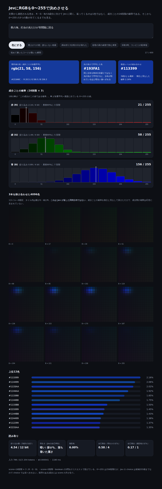
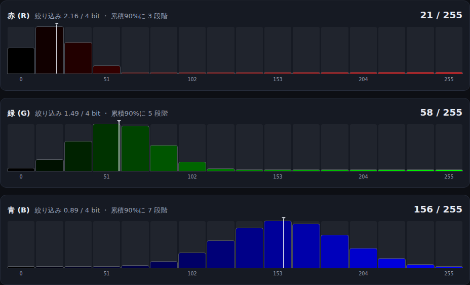

# JevにRGBを0〜255で聞く — 256段階とchoiceの255個

[前回](../../jev-form/blog/guessing-prefectures-with-jev.md)は47都道府県を当てさせて、Jevの確率分布をそのまま画面に出した。候補が47個に固定されていて、外れても地方単位で「近いか」を測れるので、分布の読み方を説明するには都合がよかった。

ただしあれは「用意した候補から1つ選ぶ」形だ。Jevが返せるのはそれだけではない。今回は候補を選ばせるのをやめて、**色を作っている3つの数（R・G・B、各 0〜255）を別々に答えさせる**ものを書いた。返ってくるのは1色ではなく3本の確率分布で、そこから連続値の色が組み上がる。

実装は `jev-rgb/` にある。2026年9月18日時点で、オフラインのテスト27件とスタブでの画面確認までは済んでいる。実Gatewayへの接続は、この記事では未実施です。掲載している画像もスタブの出力で、Jevの実際の応答ではありません。



## 256段階は choice に並ばない

最初に考えたのは、0〜255 の256個を choice の候補に並べることだった。これは通らない。Jevの choice は候補を **255個まで** しか取れないので、1段階足りない。

惜しい数字だが、詰まったのは上限の側ではなかった。そもそも成分の強さに choice を使うのが噛み合っていない。choice は排他の選択で、候補どうしの順序を持たない。「Rは0か255か」は排他の選択ではなく、量の大小である。250と255を並べて「どちらか」と聞かれても、答える側にとっては意味のある区別ではない。

順序のある量に対応するのは score の方だ。AI SDKの型を読むと、score の応答はこうなっている。

```ts
} | {
    type: 'score';
    /** Fractional position in [0, number of levels - 1]. */
    score: number;
    /**
     * Complete distribution, keyed by zero-based level indices as strings.
     * When supplied, score is its probability-weighted mean.
     */
    probabilities?: Record<string, number>;
}
```

段階数は自由（2段階以上）で、`probabilities` に各レベルの確率が入り、`score` はその加重平均である。つまり score は、**分布と、そこから畳んだ連続値の両方を最初から返してくる**。0〜255 のような量を聞く相手としては、choice よりずっと素直だった。

## 段階を16にすると 0〜255 にちょうど着地する

では何段階にするか。細かくすれば入力トークンが増え、各レベルの説明も書き分けられなくなる。粗すぎると加重平均が中央に寄って色が動かない。

16段階にした。刻みが 17 になり、`15 * 17 = 255` で上限ちょうどに着地するからだ。16進で書けば `0x00, 0x11, 0x22, ... 0xFF` で、レベル名と値が一対一で読める。

```ts
'0 (0x00): この成分は完全に無い',
'17 (0x11): ほぼ無い',
...
'255 (0xFF): 最大。この成分が振り切れている',
```

ここで勘違いしやすいのだが、**段階は問い方の粒度であって、答えの粒度ではない**。返ってくる `score` はレベルの加重平均なので、17を掛けた値は 17 の倍数に限られない。実際、スタブの「夜の海」では R が `21 / 255` になっている。16段階で聞いて、0〜255 の連続値が出てくる。



1本の棒が「この成分がこの値である確率」で、▼ が加重平均＝画面に出ている値。Rは低い側で決まっていて（絞り込み 2.16 / 4 bit）、Bは高い側ではあるが 102〜204 に広く散っている（0.89 / 4 bit）。「青い、ただしどのくらい青いかは決めていない」がそのまま形になる。

## 8bitの平均と、光の平均は別物

分布を受け取ったら平均して終わり、とはいかない。平均を **どの目盛りで取るか** で答えが変わる。

「0と255が半々」を8bitの目盛りのまま平均すると 127.5 になる。これを線形sRGB（光の強さ）に直してから平均して戻すと 187.5 になる。60も違う。

```ts
const split = [0.5, 0, ..., 0, 0.5];
expectedValue(split);        // 127.5
expectedValueLinear(split);  // 187.5
```

どちらかが間違っているわけではない。8bitの目盛りは人の目に合わせて曲げてあるので、その上での平均と、光の量としての平均は最初から別の量である。片方だけ出すと、選んだ方の都合が画面に出てしまう。だから両方並べた。

面白いのは、**この2色の離れ方がそのまま「迷いの量」になる**ことだ。分布が1点に寄っていれば両者は一致する。割れているときだけ離れる。

## 4096色の格子は、Jevが返した分布ではない

3本の分布が手元にあると、16³ = 4096色の同時分布を作りたくなる。掛けるだけなので実装は数行で済むし、画面映えもする。実際に出している。

ただしこれは Jev が返した同時分布ではない。Jev は成分ごとに独立した設問へ答えていて、成分間の相関は応答のどこにも入っていない。掛け算で作れるのは「相関を捨てたらこうなる」であって、本物ではない。

具体的に何が落ちるか。たとえば「夕焼けか、夜か」で割れている入力を考える。夕焼けなら (R高, G中, B低)、夜なら (R低, G低, B高) で、どちらも同じくらいありそうだとする。成分ごとの分布はどちらの山も持つが、独立と見なして掛けた瞬間、(R高, G中, B高) という **どちらでもない紫** が上位に出てくる。実在しない選択肢が確率を持ってしまう。

相関まで欲しければ、色をひとまとまりの候補として choice で聞くしかない。そして choice で聞けば候補255個の制約に戻り、今度は連続値が出せなくなる。どちらの聞き方にも落ちる情報があるので、画面には「これは積である」と書いて出すことにした。

## score と分布が食い違っていたら捨てる

`experimental_evaluate` は応答の型と分布の整合を検証してくれる。それでも足したチェックがある。

```ts
if (Math.abs(score - weightedMean(distribution)) > MEAN_TOLERANCE) throw new Error('invalid-answer');
```

`score` は仕様上「`probabilities` の加重平均」である。自分で計算し直して合わなければ、score と分布が別々の根拠で返ってきたということだ。そうなるとどちらを信じても間違えるので、応答ごと捨てる。片方だけ使って先へ進むより、失敗として見える方がいい。

似た理由で、`probabilities` が欠けている応答も捨てている。SDKの型では省略可能だが、このサンプルは分布そのものが主題なので、`score` だけ返ってきても見せるものが無い。

あとは前回と同じで、確率に `NaN` が混ざっていないか（0として描くと、分布が割れているのか壊れているのか画面から区別できない）、合計が1から大きく外れていないか、`providerMetadata.gateway.cost` が空文字でないか（`Number('')` は 0 なので、弾かないと「$0」と表示してしまう）を見ている。

## 3問が同じ色の話をしているか

R・G・Bを別々に聞く以上、**3問が互いを見ずに答えられてしまう**という弱さがある。それぞれもっともらしくても、組み上がった色は誰も意図していない色かもしれない。

そこで色全体についての設問を2つ足した。5段階の `brightness`（明るさ）と boolean の `achromatic`（無彩色か）である。どちらも表示のためではなく、検算に使う。

- `brightness` と、組み上がった色の相対輝度を0〜4へ写した値のずれ
- `achromatic` と、組み上がった色の彩度から出した「無彩色らしさ」のずれ

3成分とも最大（＝白）を答えながら明るさを0（漆黒）と答えれば、ずれは4になる。ずれが大きいときは、成分ごとの回答と色全体の印象が別々の根拠で出ていることを疑える。テストではこの極端な組み合わせを固定してある。

## 分けて聞くと、何が見えるのか

47都道府県のときは「どれを選んだか、どのくらい迷ったか」だった。成分に分けて聞くと、**迷いが成分ごとに分かれて見える**。

「Bは決まっているがRが決まらない」は、絞り込み量が B 0.89 bit / R 2.16 bit という形で出る。色として1つに畳んでしまうと、この非対称は消える。畳む前の形を残しておくと、モデルが何を決めていて何を決めていないかが、色ではなく数で読める。

分布を返すモデルを使うときに毎回引っかかるのはここだと思う。最後は1つの値に畳むのだが、**畳んだ後の値だけを見ていると、畳む前に何があったかが分からない**。

## 今回書かなかったこと

- 実Gatewayへの接続。テストとスタブまでで、実際の応答は見ていない
- 知覚均等な色空間（Lab・Oklab）。混色は線形sRGBで足りるとした。主題は分布の畳み方であって色差ではない
- 「正しい色」の正解表。当てるゲームにはしない

設計の理由は [docs/DESIGN.md](../docs/DESIGN.md) に、動かし方は [README](../README.md) に書いてある。
